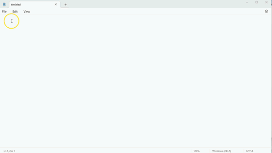

# AIA (AI Anywhere) ChatGPT Usage Tool

## Overview
This program utilizes OpenAI's ChatGPT API to generate responses to user input based on text in the clipboard or selected text. The program includes a system tray icon, created using the PyStray library, allowing the user to interact with the program and exit the program easily.  

## Demo

## Reasoning
Entering a prompt and copying from the ChatGPT site into emails, notepad, Microsoft Word, Excel etc. can become a bit of a hassle so I wanted to streamline the process for myself and that's what this tool does.  Also, I didn't like longer responses being cut off which doesn't seem to happen as much when using the API.  More features will be added in the future, with a focus for using ChatGPT for coding, and hopefully being able to copy formatted text (although that feature might not be cross-platform).  Be sure to watch the repository to keep up to date.

## Features
- Generates a response to user input
- Copies the response to the clipboard
- Optionally pastes the response to the active window
- Adds an icon to the system tray so you can right-click to exit
- Provides notifications to update the user on the status of the response generation process
- Customizable through the `settings.ini` file

## Usage
The program has three main functions that can be triggered using hotkeys, which can be configured in the `settings.ini` file: 
1. `Ctrl` + `Shift` + `/` - Uses text in the clipboard as a prompt and copies the result to the clipboard.
2. `Ctrl` + `Shift` + `]` - Uses text in the clipboard as a prompt and pastes the result in the current window .
3. `Ctrl` + `Shift` + `0` - Copies and processes highlighted text from the current window and pastes it at the cursor location (note that this may not work in all programs due to security restrictions and other facotrs, but it will work in some, such as Notepad where it is nice to do this with one hotkey combo).

## API Key
The program requires an OpenAI API key to access the ChatGPT API. You will be prompted for your API key on startup, unless it is stored in the `Secrets/api_key.txt` file.

## Requirements
A requirements file with the necessary requirements will be included in the program files.

## Platform Support
This program was created with Python 3.10. It has only been tested on Windows 11. Cross-platform libraries were used in its creation, so it may work on other platforms as well.

## Additional Modules Used
- keyboard==0.13.5
- notify-py==0.3.42
- Pillow==9.4.0
- PyAutoGUI==0.9.53
- pyperclip==1.8.2
- PySimpleGUI==4.60.4
- pystray==0.19.4
- requests==2.28.2

## Disclaimer
The authors and contributors of this program provide it as-is, without any warranties or guarantees. They cannot be held responsible for any damages resulting from the use of this program.

## License
This program is licensed under the MIT license.
